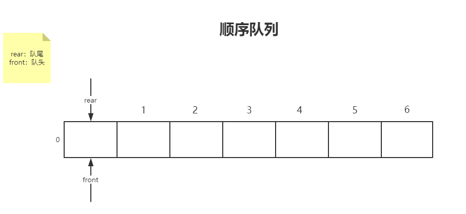

# C语言队列

分类：1，顺序队列 2，链式队列

## 1：顺序队列


定义：队列是一种先进先出的**线性表**（由n个类型相同的数据元素 构成的有限序列）




空队列；rear&&front==0；

## 											顺序循环队列

### 解决“假溢出”

实现方法：使rear变为0，指向第一个单元，各异采用取余运算，

rear=（rear+1）%MAXqueueSize。

rear=（5+1）%6=0；


### 判断循环队列空队列与满队列：

1：怎加标志位（FLAG）

初始队列时使flag=0；入队成功flag=1；出队成功flag=0；

为空：front==rear&&flag==0

为满：front==rear&&flag==1

2：少用一个存储单元。

满: (rear+1)%MAXqueueSize=front;

空：rear=front；


## 										顺序队列的实现

```C
#define MAXqueueSize 10
typedef struct
{
    DATATYPE queue[MAXqueueSize];//存放队列元素到queue数组
    int front;//队头指针
    int rear;//队尾指针
    
}seqqueue;

typedef char DATATYPE;//DATATYPE是队列元素类型，自己重新定义

//初始化队列
void Initqueue(seqqueue *q)
{
    q->front=0;
    q->rear=0;
}
//判断队列是否为空
int empty_queue(seqqueue q)
{
    if(q.front==q.rear)
		return 1;
    else 
        return 0;
    
}
//获取队头元素
int gethead(seqqueue q,DATATYPE *e)
{
    if(q.front==q.rear)
    {
        printf("NULL");
        return 0;
    }
    else
    {
        *e=q.quueue[q.front];
        return 1;
        
    }
    
}

//入队

int enqueue(seqqueue *q,DATATYPE e)
{
    if(q->front==(q->rear+1)%MAXqueueSize)//判断队列是否为满
    {
        printf("FULL");
        return 0;
        
    }
    else 
    {
        
        q->queue[q->front]=e;//将e放入队列中
        q->rear=(q->rear+1)%MAXqueueSize;//队尾向后移动一个位置
        return 1;
    }        
}
//出队
int dequeue(seqqueue *q,DATATYPE *e)
{
    if(q->front==q->rear)
    {
        printf("NULL");
        return 0;
    }
    else
    {
        *e=q->queue[q->front];//将队头元素赋值给e
        q->front=(q->front+1)%MAXqueueSize;//指向下一个元素
        return 1;        
    }    
}


```


